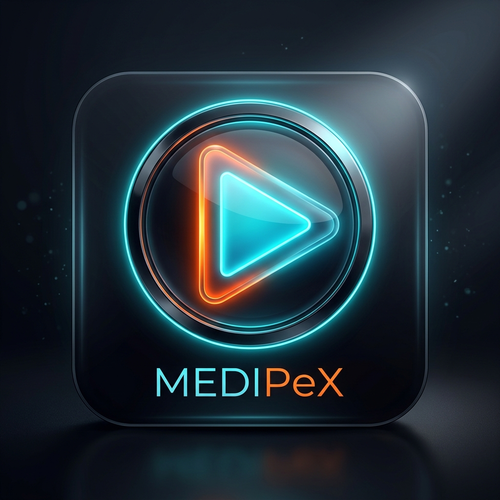

<div align="center">
  
  <h1>MediPeX v1.0</h1>
  
  <p><strong>A powerful, modern, standalone desktop media suite built with Wails and Go.</strong></p>
  
  <p>
    <a href="https://github.com/asutx-78"></a>
    <a href="https://wails.io"></a>
    <a href="https://golang.org"></a>
    <a href="LICENSE"></a>
  </p>
</div>

---

<div align="center">
  <h2>📥 Download Latest Release</h2>
  <a href="https://github.com/asutx-78/MediaPeX/releases/latest/download/MediPeX.exe">
    
  </a>
  <p><em>(Compatible with Windows 10 & 11)</em></p>
</div>

---

MediPeX unifies local media playback (like VLC) with seamless, ad-free YouTube streaming inside a single, beautifully designed application. Say goodbye to bloated web browsers and slow electron apps.

## ✨ Features

- **Hybrid Media Playback**: Play offline media (`.mp4`, `.mkv`, `.mp3`) alongside direct YouTube streams in one unified queue.
- **Gorgeous Theme Engine**: Choose from multiple pre-built themes, including **Dark**, **Goth**, and a stunning premium **Glassmorphism** UI.
- **Robust Playlist Management**: Create, reorder, shuffle, and save custom playlists natively to your machine.
- **Zero-Latency YouTube Integration**: Built on an embedded, highly-optimized YouTube framework immune to standard API rate limits.
- **Lightning Fast & Lightweight**: Powered by Go and Wails (using native OS WebViews), resulting in a tiny memory footprint compared to Electron.
- **Advanced Custom Controls**: Features precision seek bars, playback speed toggling (0.5x to 2.0x), and A-B loop repeating.

## 🎨 Themes

MediPeX includes a dynamic CSS variables engine supporting multiple visual modes:
* **Default (VLC)** - The classic, high-contrast orange and black.
* **Dark** - A sleek, minimal midnight theme.
* **Goth** - Deep crimson and abyss black.
* **Glass** - A premium, frosted-glass translucent UI with a dynamic ocean gradient.

## ⌨️ Keyboard Shortcuts

Never reach for your mouse again.

| Shortcut | Action |
|----------|--------|
| `Space` | Play / Pause |
| `Arrow Left` / `Right` | Seek backward / forward 10 seconds |
| `Shift + Arrow Left/Right` | Play Previous / Next media in playlist |
| `Arrow Up` / `Down` | Volume Up / Down (5%) |
| `Shift + >` / `<` | Increase / Decrease playback speed |

## 🛠️ Installation & Development

### Prerequisites
- [Go 1.20+](https://golang.org/doc/install)
- [Node.js & npm](https://nodejs.org/)
- [Wails CLI](https://wails.io/docs/gettingstarted/installation)

### Running Locally
To launch the app in live-reloading development mode:
```bash
wails dev
```

### Compiling for Release
To build the standalone `.exe` (or macOS/Linux equivalent):
```bash
wails build
```
The compiled executable will be located in `build/bin/MediPeX.exe`.

## 📜 License

This project is open-source and licensed under the MIT License - see the [LICENSE](LICENSE) file for details.
